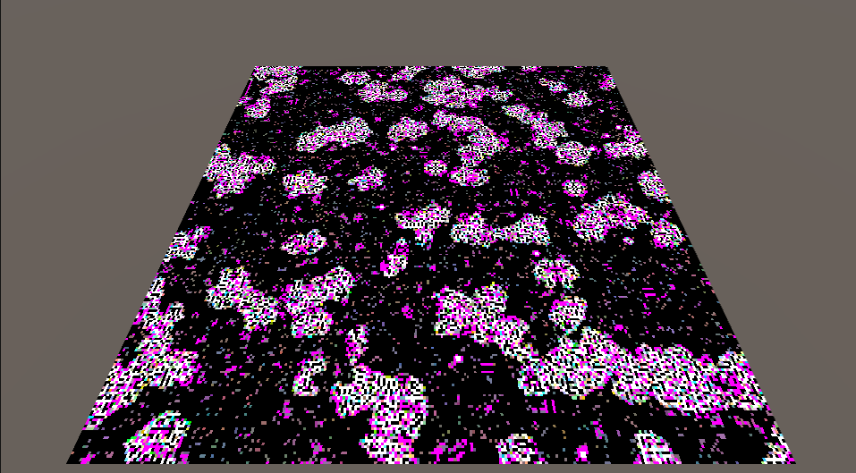

# ライフゲーム

ライフゲームの「過疎」を実装せよ。
また、独自の実装を追加してください

# 拡張した点

-　自分が死んでいてかつ隣接する生きたセルが5つ以上の時誕生するようにした
-
-
-

# 進め方

- 本リポジトリをフォークしてください
- フォークしたリポジトリをcloneします
- Unityのプロジェクトを更新して実装してください。
- このテキストファイルに変更点を記載してください
- result.pngを自分の結果を保存して差し替えてください
- プルリクエストを出して提出してください
