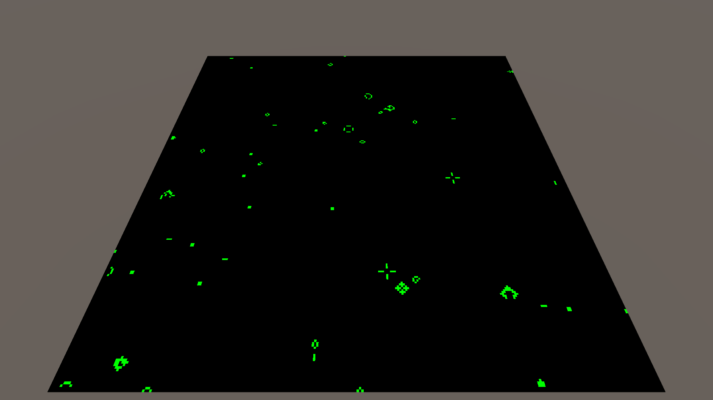

# ライフゲーム

ライフゲームの「過疎」を実装せよ。
また、独自の実装を追加してください

# 拡張した点

-is_alive関数にmaxLumとい引数を追加（引数なしでも関数の使用は可能）
-周りに3つ以上元気なセル（輝度0.8以上）があれば、さらに明るい次の世代が誕生する。
-
-

# 進め方

- 本リポジトリをフォークしてください
- フォークしたリポジトリをcloneします
- Unityのプロジェクトを更新して実装してください。
- このテキストファイルに変更点を記載してください
- result.pngを自分の結果を保存して差し替えてください
- プルリクエストを出して提出してください
